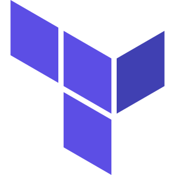

<h1 align="center">
    
</h1>

##  Descrição do Repositório
Este repositório foi criado com o intuito de ser onde eu armazenarei todos os algoritmos / códigos criados durante o meu aprendizado de Terraform.

## :hammer_and_wrench: Features
- `Terraform`
- `Azure Subscription`

## ✨ Tecnologias
Em cada sub-repositório há um laboratório independente dos demais, onde cada laboratório pode requisitar uma tecnologia diferente. Para informações mais específicas, consulte o guia dentro de cada sub-repositório para saber quais são as tecnologias necessárias. Em termos gerais, as tecnologias usadas são:

  
Made with ❤ by Lucas Araújo

